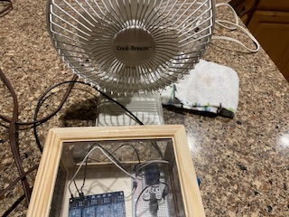
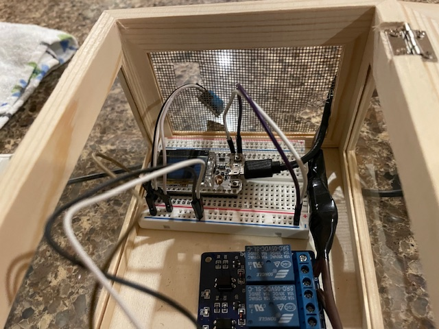

# AtticFan

## Overview
Embedded Systems project for controlling an attic fan to regulate temperature.

Run by:
```
npm i
npm run dev
```

## Problem
During the summer, attics can become excessively hot, leading to increased energy 
costs from continuous air conditioning usage. This project aims to address this 
issue by implementing an attic fan system. 
The fan is controlled wirelessly, providing users with the ability to 
manage attic temperature efficiently.

## Wires and Enclosure



**Items**
- Relay
- ESP32 Arduino
- DHT Temperature Sensor
- Fan

## Wireless Communication
The system utilizes Bluetooth for wireless communication. The goal is to create a web 
application that connects to the ESP32 Arduino via Bluetooth. This web application 
allows users to control the attic fan in three modes:
 - Manual off mode: turn the fan off 
 - Manual on mode: turn the fan on 
 - Auto mode: Set a temperature threshold, and the fan will automatically turn on or off based on the detected temperature. 

